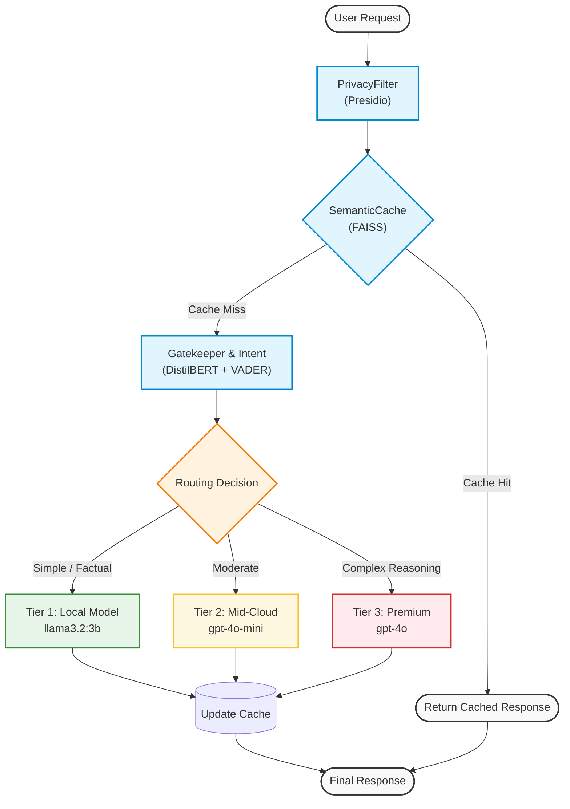

# Cascade Engine

This repository provides the code for our framework **Cascade Engine: A Multi-Tier, Intelligent Routing Framework for Cost-Effective LLM Inference**. In this README, we guide you through installing the library, using the intelligent cascade routing effectively, and reproducing our results.

## Installation

Follow these steps to set up the environment and install the necessary dependencies.

1. **Clone the repository:**
```bash
git clone https://github.com/your-username/cascade-engine.git
cd cascade-engine
```

2. **Create and activate the environment:**
```bash
python -m venv venv
source venv/bin/activate
```

3. **Install the package and dependencies:**
```bash
pip install -r python_core/requirements.txt
```

4. **Download required models (for intelligent layers):**
```bash
python -m spacy download en_core_web_lg
```

## Getting Started

This library allows you to run multi-tier cascading strategies with intelligent preprocessing layers for any downstream LLM application. 

### Step 1. Initialize the Intelligent Layers
Cascade Engine relies on preprocessing layers to aggressively filter and cache queries before they reach expensive models.

```python
from python_core.router.intelligent_layers import SemanticCache, PrivacyFilter, Gatekeeper

# 1. Initialize Privacy Filter (Presidio) to redact PII
privacy_filter = PrivacyFilter()

# 2. Initialize Semantic Cache (FAISS) for exact/close matches
cache = SemanticCache(threshold=0.85)

# 3. Initialize Gatekeeper (DistilBERT + VADER) for complexity routing
gatekeeper = Gatekeeper()
```

### Step 2. Initialize the Engines
Define the tiers of models you want to use. We typically use a 3-tier system: Local, Mid-Cloud, and Premium-Cloud.

```python
from python_core.engines.local_engine import OllamaEngine
from python_core.engines.cloud_engine import OpenAIEngine

tier1 = OllamaEngine(model_name="llama3.2:3b")
tier2 = OpenAIEngine(model_name="gpt-4o-mini", api_key="YOUR_KEY")
tier3 = OpenAIEngine(model_name="gpt-4o", api_key="YOUR_KEY")

engines = [tier1, tier2, tier3]
```

### Step 3. Run Queries through the Router
You can now use the `CascadeRouter` or `FrugalRouter` to process queries dynamically based on complexity and confidence.

```python
from python_core.router.cascade_router import FrugalRouter

router = FrugalRouter(
    engines=engines,
    privacy_filter=privacy_filter,
    cache=cache,
    gatekeeper=gatekeeper,
    confidence_threshold=0.9
)

query = "Write a python script to reverse a linked list."

# The router will automatically triage through cache, privacy, and the required model tier
response, metadata = router.predict(query)

print(response)
print(f"Routed to: {metadata['engine_used']}")
print(f"Cost: ${metadata['cost']}")
```

## Architecture & Request Flow

When a user submits a query, it undergoes a sequential triage process designed to minimize costs while maximizing safety and speed. This ensures that expensive premium models are only called when absolutely necessary.



## Reproducing Results

To reproduce the results presented in the paper, including the Pareto frontier evaluations on Alpaca-Eval and the ablation studies:

### 1. Run the Test Suite
Ensure all components are functioning correctly:
```bash
# Fast tests (skips loading heavy models)
pytest -m "not heavy"

# Full test suite
pytest
```

### 2. Run Benchmarks
Run the experiment script to execute the inference pipeline against the baseline models (e.g., RouteLLM):
```bash
python python_core/scripts/run_experiment.py
```
This will create a timestamped folder inside the `results/` directory containing `pareto.csv` and `manifest.json`.

### 3. Generate Paper Figures
Once your experiments have finished, you can generate the exact PDF plots used in the manuscript:
```bash
python -m python_core.scripts.make_figures results/<YOUR_TIMESTAMP_DIR>
```

## Code Structure

Below is a high-level overview of the code in this repository:

- **`python_core/engines/`**: Connectors to the underlying LLMs. `local_engine.py` handles local open-source models (via Ollama), while `cloud_engine.py` handles standard APIs (OpenAI).
- **`python_core/router/`**: The core logic of the framework.
  - `cascade_router.py`: The Frugal and base routing logic.
  - `learned_router.py`: Implementation of Contextual Discounted Thompson Sampling (CD-TS).
  - `intelligent_layers.py`: The preprocessing modules (SemanticCache, PrivacyFilter, Gatekeeper).
  - `benchmark.py`: Evaluates the routers against Alpaca-Eval.
- **`python_core/scripts/`**: Experiment execution (`run_experiment.py`) and visualization generation (`make_figures.py`).
- **`paper/`**: The LaTeX source files and a compiled Markdown version of our academic manuscript.

## Citation

If you use this codebase or find our framework useful, please cite our paper:

```bibtex
@article{cascadeengine2026,
  title={Cascade Engine: A Multi-Tier, Intelligent Routing Framework for Cost-Effective LLM Inference},
  author={Nabin Prasad Dev},
  year={2026},
  journal={arXiv preprint}
}
```

## License

This project is licensed under the MIT License - see the [LICENSE](LICENSE) file for details.
